=================================================
**Дебагер на STM32 SWV/SWO**
=================================================

**Содержание**: *Пример работы дебагера на STM32 для использования в проектах без использования юарта на JTAG работает*

Структура директории
-------------------------------------------
+-------------------+----------------------------------+ 
| Папка и файлы     |            Описание              |
+===================+==================================+ 
|        example    | Исходный код проекта с примером  |
+-------------------+----------------------------------+
|  src              | Изображения                      |
+-------------------+----------------------------------+

**Оглавление:**
----------------

      #. `Теория`_
      #. `Настройка`_ 
      #. `Обзор возможностей`_  
      #. `Консоль`_  
      #. `Обзор возможностей`_  
            #. `График изменения переменной`_  
            #. `График прирываний`_  
            #. `Не большое отступление`_  
      #. `Вывод`_  

**Теория**
--------------

Упрощает взаимодействие с програмой и не добавляет дополнительный выходов, те самым не занимая их. Используется
только в дебаге и не более. Есть возможность добавть графики и выводить логи, тем самым это намного мощьнее аппарат
чем обычная консоль.

**Настройка**
--------------

1) Для начала создаем просто проект.

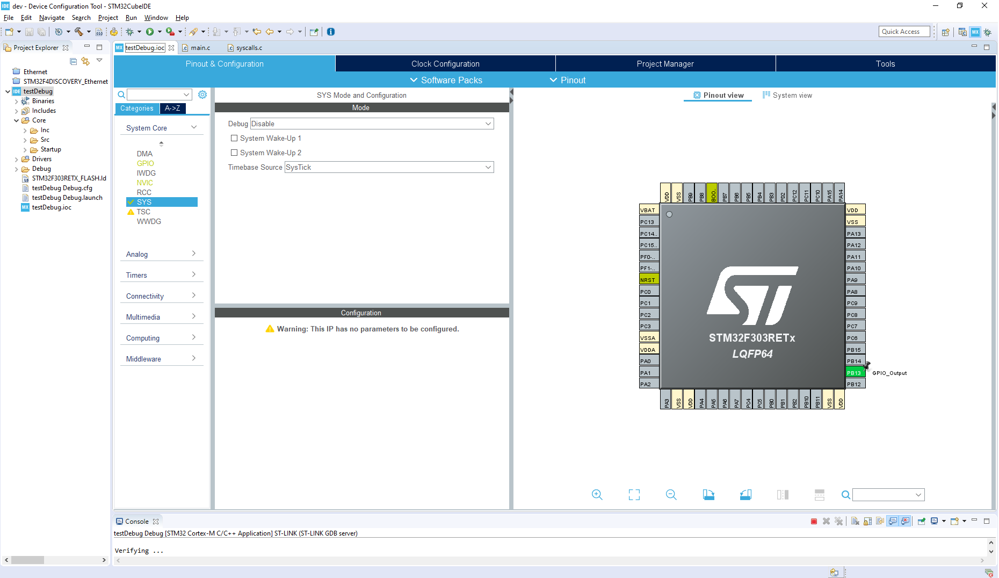

2) Переходим на страницу с временными характеристиками и указываем нужную частоту работы процессора, далее это будет использовано для отладки.

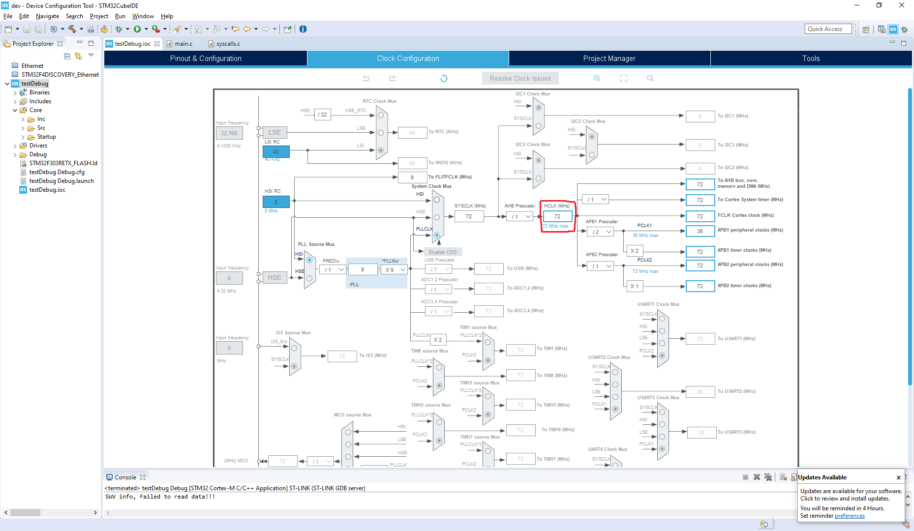

3) После чего генерируем проект и переходим в main.c и вставляем такой код:

.. code-block:: C

      int _write(int file, char *ptr, int len)
      {
        for(int i = 0 ; i < len ; i++)
          ITM_SendChar((*ptr++));
        return len;
      }

Этот код перегружает функцию ``_write`` описанную в файле ``syscalls.c``.
ЕСЛИ НЕ РАБОТАЕТ:
Идем в файл ``syscalls.c`` и в функции ``_write`` меняем ``__io_putchar`` на ``ITM_SendChar``.
Должно выйти примерно так:

.. code-block:: C

      __attribute__((weak)) int _write(int file, char *ptr, int len)
      {
            int DataIdx;

            for (DataIdx = 0; DataIdx < len; DataIdx++)
            {
                  ITM_SendChar (*ptr++);
            }
            return len;
      }
      
Но сейчас файл не собереться. Добаляем в этот же файл заголовок: #include ``"stm32f3xx_hal.h"``

4) Так же надо подключить заголовок для возможности использования ``printf``.

.. code-block:: C

      #include <stdio.h>			//print     

5) Далее переходим к настройкам компилятора. Настройки компилятора. ``Debug configuration...``

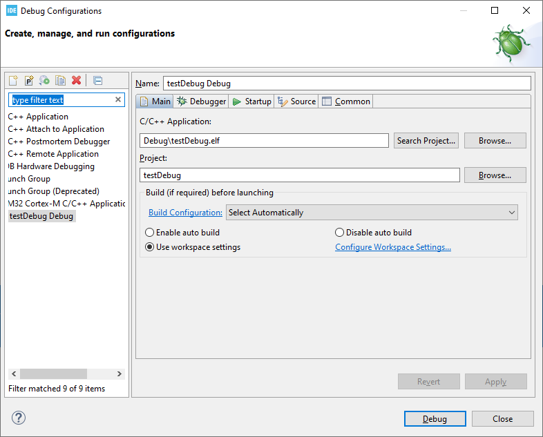

6) Здесь нечего не меняем. И переходим на следующую вкладку ``Debugger`` Тут уже все сложнее. В разделе ``Serial Wire Viewer(SWV)`` надо актевировать чекбокс ``Enable`` в активирующемся окне ввести скорость, которая была настроена ранее. В окне ``Core Clock`` . Пример как должно быть настроено приведен ниже.

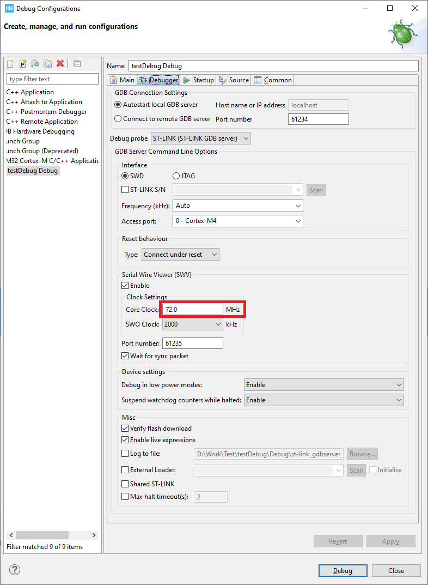

7) После этих операций можно смело писать тестовый код и собирать проект, для теста предлагаю вывести этот код: ``printf("Hello world\n");`` 

**Запуск и отладка**
---------------------

8) Выполнив все предыдущие шаги запускаем отладчик. Остановившись на первом брекпоинте надо настроить окна для вывода новой информации. для этого переходим в следующий раздел и меню:

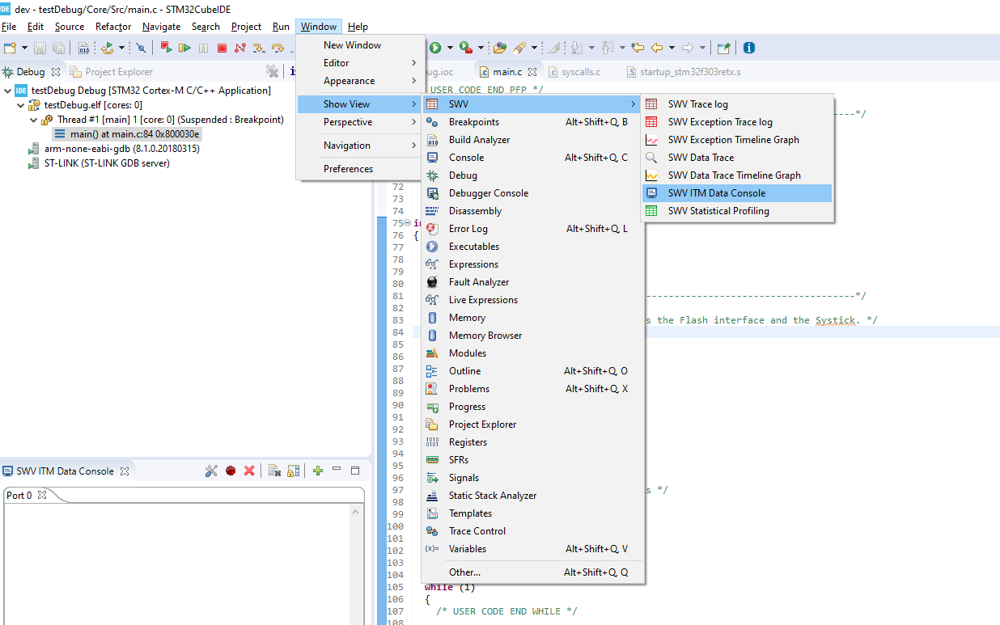

9) В консоли выводиться информация с ``printf``. После чего появиться такое окно (показано ниже) и в нем жмякаем на настройки.

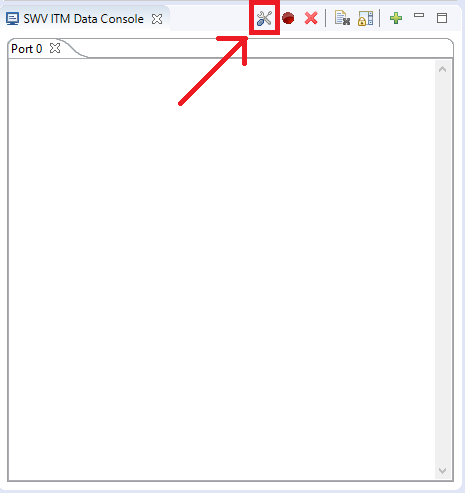

10) Теперь настраиваем тут все. По сути для раоты консоли надо только включить чекбокс в нижней линейке на позии 0, как показано на риссунку красным.

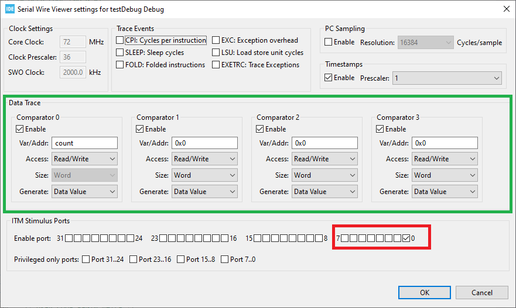

Все что обвидено зеленым используется для построения гграфиков и отслеживания переменным в окне ``SWV Data Trace Timeline Graph``. Далее это будет расмотренно.

11) Все, на этом настройка оконченна. *Запескаем* Для запуска сначала нажимаем запуск дебага, после прошивки програама остановиться в самом начале и надо нажать запись как показано на рисунке ниже. Все увидете нужную информацию.

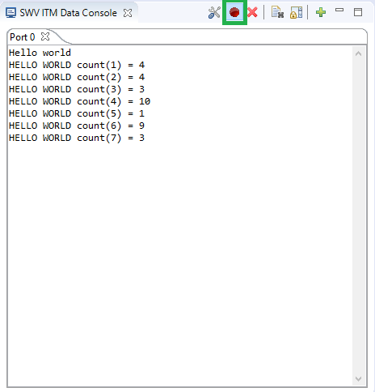

**Обзор возможностей**
---------------------

Все вызовы ниже описаных окон осущиствляються через:

**Консоль**
"""""""""""

Вызывается через окно ``SWV ITM Data Console`` имеет возможность выводить данные через printf как при отладке на ПК.

**График изменения переменной**
"""""""""""

Вызывается через окно ``WV Data Trace Timeline Graph`` удобно отслеживать накопления, отслеживает до 4 переменных, задаються переменные которые отслеживать через настройки в разделе ``Data Trace`` можно указывать область памяти или переменную, вроде работает только с глобальными. Рисунок настройки ниже (зеленая область).

Пример реализации.

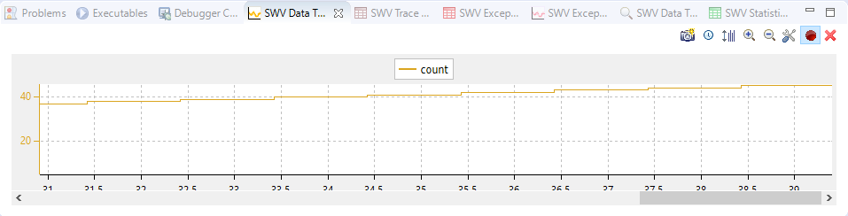

**График прирываний**
"""""""""""

Вызывается через окно ``SWV Exception Timeline Graphic`` имеет возможность графически отслеживать прирывания в часовой области.

**Не большое отступление**
-------------------------

Так же есть возможность отслеживать изминение переменной. Работает только для глобальных переменных.

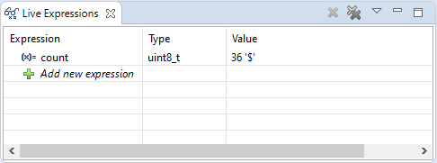

**Вывод**
----------

Теперь можно сотворить такое:

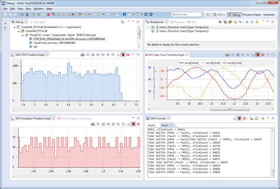
