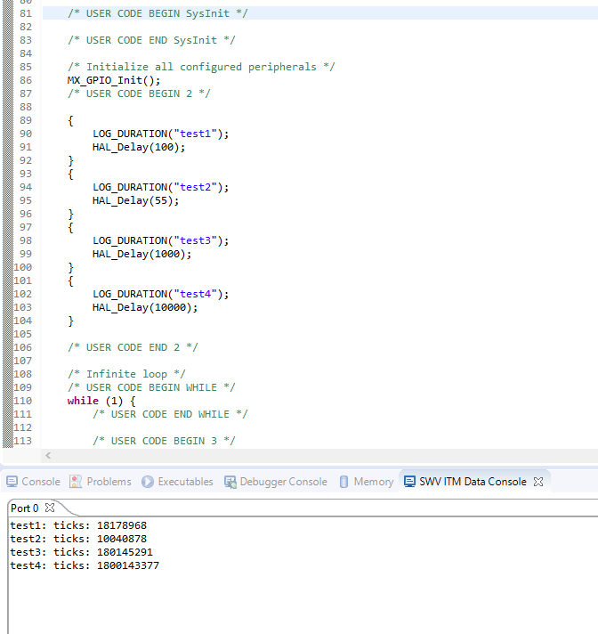

=================================================
**Профилировщик программ**
=================================================

**Содержание**: *Пример работы профилировщика на STM32 для использования в проектах на C++. Для вывода результата используется SWV(SWO)*

Структура директории
-------------------------------------------
+-------------------+----------------------------------+ 
| Папка и файлы     |            Описание              |
+===================+==================================+ 
|        example    | Исходный код проекта с примером  |
+-------------------+----------------------------------+
|  src              | Изображения                      |
+-------------------+----------------------------------+

**Оглавление:**
----------------

      #. `Теория`_
      #. `Настройка`_ 
      #. `Запуск и отладка`_  
      #. `Тестирование`_  
      #. `Вывод`_  

**Теория**
--------------

Упрощает проверку кода на быстродействие. Выводит сколько тактов было затрачено на выполнение того или иного кода. Без применения таймеров, не занимает их!!!!!!

**Настройка**
--------------

1) Добавляем файл ``profile.h`` в проект.

2) Подключаем файл в main.cpp, а именно пишем такую строку: ``#include "profile.h"``

3) Меняем строку с подключением конфигурационных файлов в ``profile.h``. Это 15 строка, заполняем в зависимости от спользуемой серии МК. 

+-------------------+----------------------------------+ 
| Сория    			|            Наименование	       |
+===================+==================================+ 
|        F0    		| stm32f0xx_it.h  				   |
+-------------------+----------------------------------+
|  F1              	| stm32f1xx_it.h                   |
+-------------------+----------------------------------+
|  F2              	| stm32f2xx_it.h                   |
+-------------------+----------------------------------+
|  F3              	| stm32f3xx_it.h                   |
+-------------------+----------------------------------+
|  F4              	| stm32f4xx_it.h                   |
+-------------------+----------------------------------+
|  F7              	| stm32f7xx_it.h                   |
+-------------------+----------------------------------+
|  L0              	| stm32l0xx_it.h                   |
+-------------------+----------------------------------+
|  L1              	| stm32l1xx_it.h                   |
+-------------------+----------------------------------+
|  L5              	| stm32l5xx_it.h                   |
+-------------------+----------------------------------+
|  L4              	| stm32l4xx_it.h                   |
+-------------------+----------------------------------+
|  H7              	| stm32h7xx_it.h                   |
+-------------------+----------------------------------+
            
3) Все. Настройка окончена. Переходим к использованию.

**Запуск и отладка**
---------------------

Что бы запустить профайл надо применить один макрос и взять все это в скобки. Пример кода ниже.

.. code-block:: C

	{
		LOG_DURATION("test1");
		HAL_Delay(100);
	}

Обязательно использовать фигурные скобки!! Внутри них должен располагаться функционал скорость которого измеряем. Вместо текста "test1" может быть любое сообщение, которое в дальнейшем будет выведено в SWV порт.

**Тестирование**
---------------------

Пример точности профайлера приведен ниже. Использовалась стандартная функция ``HAL_Delay(100);``. Функция всегда врет. По этому точность таймера можно считать удовлетворительной.

**Вывод**
----------

Показано пример работы профайлера для стандартных задач оптимизации в различных задачах.
