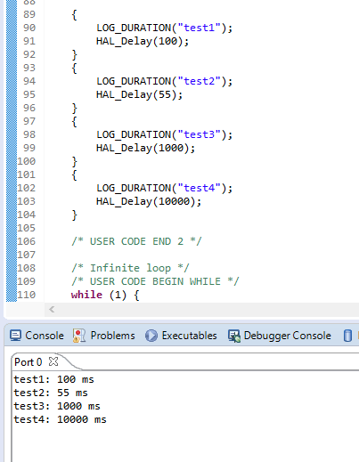

=================================================
**Профилировщик программ**
=================================================

**Содержание**: *Пример работы профилировщика на STM32 для использования в проектах на C++. Для вывода результата используется SWV(SWO)*

Структура директории
-------------------------------------------
+-------------------+----------------------------------+ 
| Папка и файлы     |            Описание              |
+===================+==================================+ 
|        example    | Исходный код проекта с примером  |
+-------------------+----------------------------------+
|  src              | Изображения                      |
+-------------------+----------------------------------+

**Оглавление:**
----------------

      #. `Теория`_
      #. `Настройка`_ 
      #. `Запуск и отладка`_  
      #. `Тестирование`_  
      #. `Вывод`_  

**Теория**
--------------

Упрощает проверку кода на быстродействие. Выводит сколько мс было затрачено на выполнение того или иного кода. Без применения таймеров, не занимает их!!!!!!

**Настройка**
--------------

1) Добавляем файл ``profile.h`` в проект.

2) Подключаем файл в main.cpp, а именно пишем такую строку: ``#include "profile.h"``

3) После чего переходим в файл ``stm32f4xx_it.c`` (это файл с прерываниями)

      Здесь нам понадобиться объявить переменную: 
      
      .. code-block:: C
            
            extern uint64_t timer;
            
      После чего переходим в конец файла, а именно к функции ``SysTick_Handler`` это прерывание по системному таймеру. Тут мы итерируем каждую миллисекунду ранее объявленный таймер. Получиться такой код:  
      
      .. code-block:: C
      
            void SysTick_Handler(void)
            {
              /* USER CODE BEGIN SysTick_IRQn 0 */

              /* USER CODE END SysTick_IRQn 0 */
              HAL_IncTick();
              /* USER CODE BEGIN SysTick_IRQn 1 */
              ++timer;
              /* USER CODE END SysTick_IRQn 1 */
            }
            
4) Все. Настройка окончена. Переходим к использованию.

**Запуск и отладка**
---------------------

Что бы запустить профайл надо применить один макрос и взять все это в скобки. Пример кода ниже.

.. code-block:: C

	{
		LOG_DURATION("test1");
		HAL_Delay(100);
	}

Обязательно использовать фигурные скобки!! Внутри них должен располагаться функционал скорость которого измеряем. Вместо текста "test1" может быть любое сообщение, которое в дальнейшем будет выведено в SWV порт.

**Тестирывание**
---------------------

Пример точности профайлера приведен ниже. Использовалась стандартная функция ``HAL_Delay(100);`` так как этот профайлер не разрабатывался и не задумывался как сверх высокоточный функционал. Он создан для оценочной характеристики и имеет погрешность ±1 мс.

**Вывод**
----------

Показано пример работы профайлера для стандартных задач оптимизации в различных задачах.
